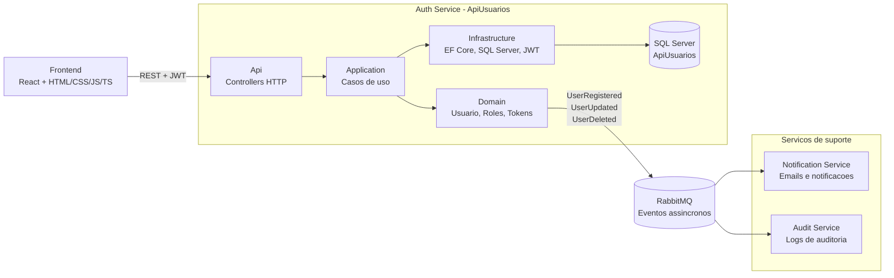
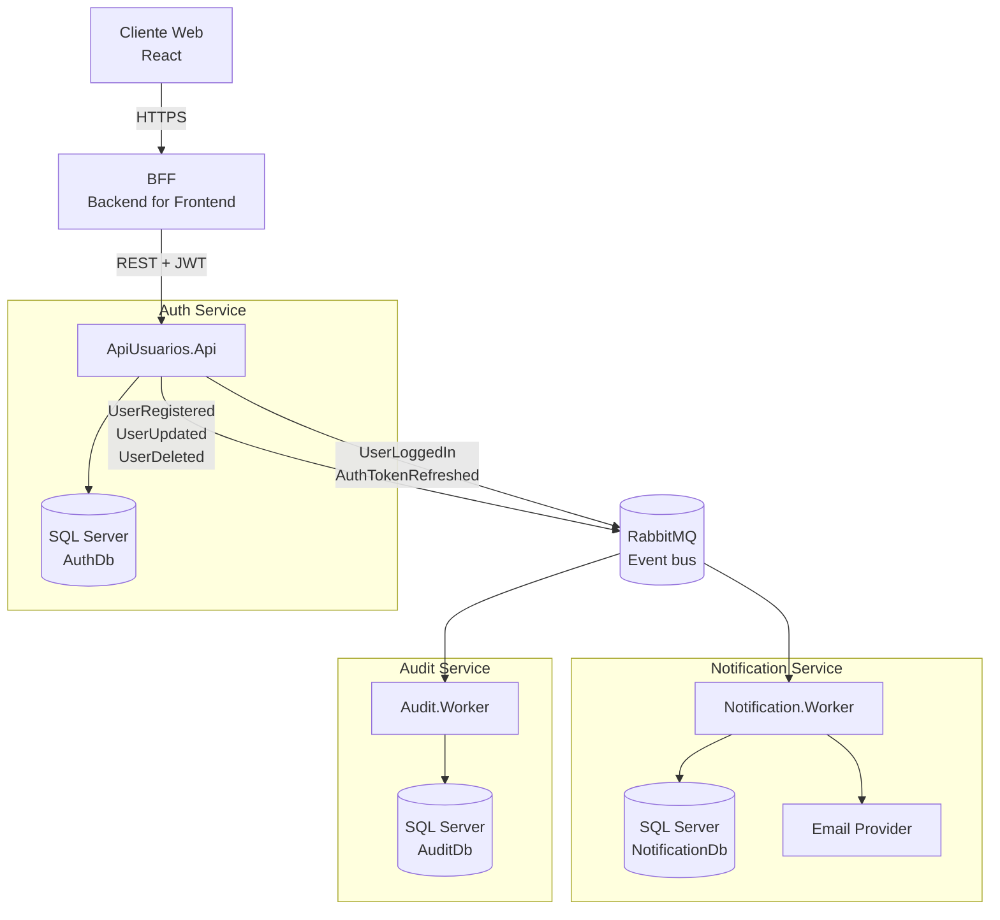

# Arquitetura do Projeto

Este documento descreve a arquitetura da aplicacao atual `ApiUsuarios` e a direcao de evolucao baseada em `stack.md`.

## Objetivo

`ApiUsuarios` e o servico de autenticacao e identidade do ecossistema. Ele deve ser responsavel por cadastro, login, emissao de JWT, refresh token, logout, autorizacao por roles e consulta da conta autenticada.

No desenho futuro de micro-servicos, este projeto representa o `Auth Service`.

## Stack base

A stack alvo esta documentada em `stack.md`.

Resumo aplicado a este projeto:

- Backend: ASP.NET Core.
- Linguagem alvo: C# 14.
- Plataforma alvo para novos servicos: .NET 10 LTS.
- Plataforma atual da aplicacao: .NET 10 LTS (`net10.0`).
- Autenticacao: JWT Bearer Token.
- Sessao: access token curto + refresh token rotacionado.
- Banco atual: SQL Server.
- ORM: Entity Framework Core.
- Containerizacao: Docker e Docker Compose.
- Arquitetura alvo: Clean Architecture.
- Mensageria futura: RabbitMQ.
- Frontend consumidor: React + HTML/CSS/JavaScript/TypeScript.

## Estado atual da aplicacao

A aplicacao atual esta organizada em uma estrutura simples por pastas:

```text
Controllers/
Data/
Dtos/
Models/
Services/
Migrations/
Program.cs
```

Responsabilidades atuais:

- `Controllers`: camada HTTP da API.
- `Services`: regras de aplicacao e acesso ao banco.
- `Data`: `DbContext` e configuracao EF Core.
- `Models`: entidades persistidas e modelos de resposta.
- `Dtos`: contratos de entrada e saida da API.
- `Migrations`: historico versionado do schema SQL Server.
- `Program.cs`: composicao da aplicacao, DI, Swagger, JWT, health check e pipeline HTTP.

Esse desenho e adequado para a fase atual do projeto, mas deve evoluir para separacao em projetos quando o servico crescer.

## Arquitetura alvo

Cada micro-servico backend deve seguir Clean Architecture:

```text
src/
  ServiceName.Api/
  ServiceName.Application/
  ServiceName.Domain/
  ServiceName.Infrastructure/
tests/
  ServiceName.UnitTests/
  ServiceName.IntegrationTests/
```

Para este servico, a estrutura alvo seria:

```text
src/
  ApiUsuarios.Api/
  ApiUsuarios.Application/
  ApiUsuarios.Domain/
  ApiUsuarios.Infrastructure/
tests/
  ApiUsuarios.UnitTests/
  ApiUsuarios.IntegrationTests/
```

## Diagrama de dominios

O diagrama abaixo mostra o dominio atual da aplicacao e os dominios de suporte realmente relacionados ao servico de autenticacao.



Leitura do diagrama:

- `Auth Service` e o dominio atual deste repositorio.
- `Usuario`, `Roles` e `Tokens` sao as principais regras de dominio atuais.
- SQL Server pertence ao Auth Service e nao deve ser acessado diretamente por outros servicos.
- RabbitMQ sera usado para publicar eventos do Auth Service para servicos de suporte quando eles existirem.
- O frontend React consome APIs REST usando JWT.

## Camadas

### Api

Responsavel por:

- Controllers e endpoints HTTP.
- Autenticacao e autorizacao no limite da API.
- Swagger/OpenAPI.
- Health checks.
- Middlewares.
- Conversao de requisicoes em comandos/queries da aplicacao.

Nao deve conter regra de negocio.

### Application

Responsavel por:

- Casos de uso.
- DTOs de entrada e saida.
- Validacoes de aplicacao.
- Contratos de servicos.
- Orquestracao entre dominio, repositorios e integracoes externas.

Exemplos de casos de uso:

- Registrar usuario.
- Fazer login.
- Renovar token.
- Fazer logout.
- Buscar usuario autenticado.
- Editar usuario autenticado.
- Remover usuario autenticado.

### Domain

Responsavel por:

- Entidades.
- Value objects.
- Regras de dominio.
- Constantes ou tipos de dominio, como roles.
- Eventos de dominio.

Exemplos:

- `Usuario`.
- `UsuarioRoles`.
- Regras de status, permissao e identidade.

### Infrastructure

Responsavel por:

- SQL Server.
- Entity Framework Core.
- Migrations.
- Repositorios.
- Servicos tecnicos de token e senha.
- Publicacao/consumo RabbitMQ quando existir mensageria.
- Integracoes externas.

## Fluxo HTTP atual

Fluxo simplificado de uma requisicao:

```text
Cliente
  -> Controller
  -> Service
  -> AppDbContext
  -> SQL Server
```

Fluxo alvo com Clean Architecture:

```text
Cliente
  -> Api Controller
  -> Application Use Case
  -> Domain
  -> Infrastructure Repository
  -> SQL Server
```

## Autenticacao e autorizacao

A API usa JWT Bearer Token.

Fluxo atual:

1. `POST /api/auth/register` cria usuario com role `User`.
2. `POST /api/auth/login` valida credenciais.
3. A API emite access token e refresh token.
4. O access token carrega identificador do usuario e role.
5. O refresh token bruto e devolvido ao cliente.
6. O banco guarda apenas o hash do refresh token.
7. `POST /api/auth/refresh-token` rotaciona o refresh token.
8. `POST /api/auth/logout` revoga o refresh token ativo.

Diretrizes:

- Access tokens devem ter vida curta.
- Refresh tokens devem ser armazenados apenas como hash.
- Rotas administrativas devem usar roles ou policies.
- Rotas do proprio usuario devem usar o id do token como fonte de verdade.
- Segredos de JWT devem vir de configuracao segura em ambientes reais.

## Banco de dados

Banco atual:

- SQL Server.
- Database local: `ApiUsuarios`.
- ORM: Entity Framework Core.
- Migrations: EF Core Migrations.

Tabela principal:

- `Usuarios`.

Dados principais do usuario:

- Identificacao: `Id`, `Usuario`, `Email`.
- Perfil: `Role`.
- Dados pessoais: `Nome`, `Sobrenome`.
- Senha: `SenhaHash`, `SenhaSalt`.
- Sessao: `RefreshTokenHash`, `RefreshTokenExpiracao`, `RefreshTokenCriadoEm`, `RefreshTokenRevogadoEm`.
- Auditoria simples: `DataCriacao`, `DataAlteracao`.

Diretrizes para micro-servicos:

- Cada micro-servico deve ter seu proprio banco ou schema.
- Um servico nao deve acessar diretamente tabelas de outro servico.
- Integracao entre dados deve ocorrer por API ou eventos RabbitMQ.

## Diagrama de micro-servicos

O diagrama abaixo representa a topologia minima necessaria para este projeto de autenticacao com BFF. Hoje este repositorio implementa apenas o `Auth Service`; `BFF`, `Notification Service` e `Audit Service` aparecem como componentes de suporte para a evolucao do ecossistema.



Regras do diagrama:

- O cliente nao acessa bancos diretamente.
- Cada micro-servico possui seu proprio banco.
- O frontend conversa com o `BFF`, e o `BFF` chama o `Auth Service`.
- RabbitMQ e usado apenas quando houver consumidores reais para os eventos.
- Workers consomem eventos para tarefas assincronas, como notificacao e auditoria.
- O `Auth Service` e responsavel por identidade, tokens e autorizacao.
- O `BFF` concentra necessidades especificas do frontend, como composicao de respostas, adaptacao de contratos e politicas de CORS.

## Mensageria futura

RabbitMQ sera usado para comunicacao assincrona entre micro-servicos.

Eventos candidatos para o Auth Service:

- `UserRegistered`.
- `UserUpdated`.
- `UserDeleted`.
- `UserLoggedIn`.
- `AuthTokenRefreshed`.

Diretrizes:

- Eventos devem ter contratos versionaveis.
- Consumidores devem ser idempotentes.
- Filas devem prever retry e dead-letter queue.
- Publicadores nao devem conhecer detalhes internos dos consumidores.

## Docker

Estado atual:

- A API possui `Dockerfile`.
- O ambiente local possui `docker-compose.yml`.
- Docker Compose sobe a API e SQL Server.

Diretrizes:

- Usar multi-stage build.
- Evitar segredos fixos nas imagens.
- Configuracoes devem vir por variaveis de ambiente.
- Cada micro-servico deve conseguir rodar isoladamente.

## Frontend

O frontend consumidor sera React com HTML/CSS e JavaScript/TypeScript.

Responsabilidades do frontend:

- Consumir APIs REST.
- Guardar e enviar access token.
- Renovar sessao usando refresh token.
- Controlar telas por autenticacao e permissao.
- Nao armazenar segredos sensiveis.

## Padroes de codigo

Diretrizes:

- Controllers devem ser finos.
- Regras de negocio devem ficar fora da camada HTTP.
- Services devem ser coesos e orientados a casos de uso.
- DTOs devem separar contrato externo de entidade persistida.
- Strings de dominio recorrentes devem ficar centralizadas.
- Erros devem ter resposta padronizada.
- Validacoes devem acontecer antes de alterar estado.
- Dependencias devem apontar para dentro da arquitetura.

## Dependencias entre camadas

Regra alvo de dependencias:

```text
Api -> Application -> Domain
Infrastructure -> Application/Domain
```

O `Domain` nao deve depender de `Api`, `Infrastructure`, EF Core, SQL Server, RabbitMQ ou frameworks web.

## Observabilidade

Diretrizes futuras:

- Logs estruturados.
- Correlation ID por requisicao.
- Health checks por servico.
- Metricas de HTTP, SQL Server e RabbitMQ.
- Logs de falhas em autenticacao, refresh token e consumidores de fila.

## Testes

Prioridades:

- Testes unitarios para regras de dominio e casos de uso.
- Testes de integracao para endpoints de auth.
- Testes de integracao para EF Core e SQL Server.
- Testes de contrato para eventos RabbitMQ.
- Testes dos fluxos: cadastro, login, refresh token, logout, acesso por role e acesso ao proprio usuario.

## Roadmap arquitetural

1. Manter a API atual funcional e coberta por testes.
2. Extrair contratos e casos de uso para camada `Application`.
3. Mover entidades e regras puras para `Domain`.
4. Mover EF Core, SQL Server, senha e JWT para `Infrastructure`.
5. Criar projetos separados para `Api`, `Application`, `Domain` e `Infrastructure`.
6. Adicionar RabbitMQ para eventos de usuario.
7. Adicionar observabilidade e testes de contrato.

## Decisoes arquiteturais atuais

- Este repositorio representa o Auth Service.
- SQL Server e o banco relacional atual.
- JWT Bearer Token e o mecanismo de autenticacao.
- Refresh token deve ser rotacionado e armazenado como hash.
- Roles iniciais: `User` e `Admin`.
- Clean Architecture e a arquitetura alvo para evolucao do backend.
- RabbitMQ sera adotado quando houver mais de um micro-servico consumindo eventos.
- React sera o frontend consumidor das APIs.
